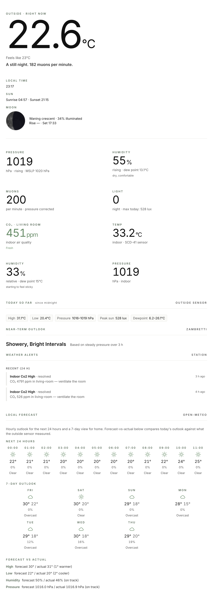
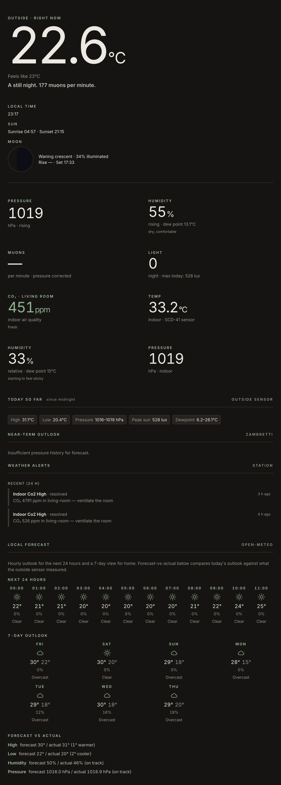

# Observatory

> A Raspberry Pi weather station, cosmic-ray muon detector, and hyperlocal science dashboard — forecast, air quality, earth & space events, and muon-flux analysis — all served on your home network.

[](LICENSE)


This repository is a **build-your-own guide**: everything you need to assemble and run your own copy. It's an actively-maintained personal build running at home — fork it, adapt it, build your own observatory.

## What it is

Observatory turns a Raspberry Pi 4 into the brain of a small home science station. An outdoor [Pimoroni Enviro Weather](https://thepihut.com/products/enviro-weather-pico-w-aboard-board-only) board reports temperature, humidity, pressure, and light over wifi; a [PicoMuon](https://ukraa.com/store/categories/cosmic-rays) cosmic-ray detector sits next to the Pi and streams muon events over USB. The Pi also polls free public APIs for earthquakes, solar weather, lightning, and aurora alerts.

It also polls free, keyless public APIs for a local weather forecast, outdoor air quality, earthquakes, space weather, lightning, aurora, and the NMDB neutron-monitor network. Everything logs to a single SQLite database. A FastAPI backend exposes the data as JSON and pushes live updates over a WebSocket, and serves a SvelteKit dashboard from the same process. Open `http://observatory.local` from any device on your home wifi and you get the whole picture in one place. No cloud, no tunnels — local-first by design.

## What it tracks

The dashboard brings everything together on one local page:

- **Local weather** — live temperature, humidity, pressure, and light from the outdoor Enviro node, with a feels-like reading, sea-level pressure (MSLP), a Zambretti near-term outlook, and a "today so far" min/max strip
- **Indoor air** — CO₂, temperature, humidity (with dew point), and pressure from an optional indoor node, with a traffic-light CO₂ verdict (fresh / stuffy / ventilate) and a "ventilate now" push when a room goes red during waking hours
- **Local forecast** — Open-Meteo hourly + 7-day outlook, with a forecast-vs-actual check against your own sensor
- **Outdoor air quality** — European AQI, PM2.5 / PM10 / NO₂ / O₃ / SO₂, in-season pollen, and UV — health-band coloured
- **Threshold alerts** — frost and rapid-pressure-fall (storm) warnings, surfaced on the dashboard and optionally pushed to your phone via [ntfy](https://ntfy.sh) (off by default)
- **Cosmic-ray muons** — live flux with an absolute (cm⁻² min⁻¹) sea-level reference, a ±1σ Poisson confidence band and anomaly flags, ADC / Landau spectrum, a fitted barometric coefficient, weekly MIP-peak gain-drift tracking, and a data-quality diagnostics panel — all from your PicoMuon
- **Space-weather science** — an NMDB (Oulu) neutron-monitor overlay and a Forbush-decrease indicator correlated with solar activity
- **Earth & space events** — earthquakes (USGS / EMSC / BGS), solar flares + Kp + solar wind (NOAA), lightning (Blitzortung), and aurora (AuroraWatch)

It also ships an offline **`picomuon` CLI** that turns raw detector CSV logs into a self-contained HTML analysis report — dead-time-corrected flux, a barometric-coefficient fit, and the ADC histogram — openable on any device with no server.

## What you'll need

A short summary of the core kit. The full bill of materials with supplier links and alternatives is in **[docs/HARDWARE.md](docs/HARDWARE.md)**.

| Part | Role | Rough cost |
|------|------|-----------|
| Raspberry Pi 4 (+ PSU, microSD, heatsink) | The brain — backend, database, dashboard | assumed owned (+£35–60 if buying) |
| Pimoroni Enviro Weather board | Outdoor temp/humidity/pressure/light sensor node | ~£30 |
| 2× AA NiMH rechargeables + charger, battery holder | Powers the weather node for months | ~£17 |
| Stevenson screen (TFA 98.1114 or 3D-printed) | Weatherproof housing for the sensor node | ~£5–20 |
| PicoMuon detector | Cosmic-ray muon detection (optional but the highlight) | ~£360 |
| Indoor CO₂ node (ESP32-S2 Feather + SCD-41) | Optional mains-powered indoor air node (CO₂/temp/humidity/pressure) | ~£95–110 |

**Cost:** a **core weather + dashboard build runs ~£70–100** (Pi assumed already owned). Adding the **PicoMuon takes the full build to ~£450–480**, dominated by the detector itself. An optional **indoor CO₂ node adds ~£95–110**.

**Effort:** roughly **6–8 weekends** from a fresh Pi to a running dashboard — provisioning the Pi, flashing the weather node, wiring the muon detector, adding the external data pollers, then building and deploying the web app.

## Architecture

```
┌──────────────────────────────────────────────────┐
│  Pi 4 (on home network, http://observatory.local)│
│  ├── Mosquitto (MQTT broker)                     │
│  ├── Muon detector via USB serial                │
│  ├── External API pollers ─── earthquakes,       │
│  │                            space weather,     │
│  │                            lightning, aurora, │
│  │                            forecast, air      │
│  │                            quality, NMDB      │
│  ├── SQLite                                      │
│  └── FastAPI ── JSON + WebSocket + static files  │
│                 (serves the SvelteKit bundle)    │
└────▲─────────────────────────────────────────────┘
     │ wifi · MQTT
     │
┌────┴─────────────────────────┐   ┌──────────────────────────────┐
│  Pimoroni Enviro Weather     │   │  Indoor air node (optional)  │
│  (outside in Stevenson scr.) │   │  (mains USB · ESPHome)       │
│  ├── BME280 (temp/hum/pres)  │   │  ├── SCD-41 (CO₂/temp/hum)   │
│  ├── LTR-559 (light)         │   │  ├── BME280 (pressure)       │
│  └── Pico W · deep sleep     │   │  └── ESP32-S2 · always on    │
└──────────────────────────────┘   └──────────────────────────────┘

      Home wifi · http://observatory.local
            ▲
            │
   ┌────────┴────────┐
   │ Any device on   │  Laptop, phone, tablet
   │ the home wifi   │
   └─────────────────┘
```

**Data flow:**

- The **Enviro Weather** node wakes from deep sleep on a schedule (e.g. every 5 minutes), reads its sensors, publishes a single MQTT message to the Pi, and sleeps again — running for months on 2× AA rechargeables.
- The optional **indoor air node** — an Adafruit ESP32-S2 Feather + SCD-41 running [ESPHome](https://esphome.io), mains-USB powered (no deep sleep) — publishes CO₂, temperature, humidity, and pressure to the Pi's broker every ~60 s over 2.4 GHz wifi. A subscriber inside the API coalesces each cycle's per-sensor messages into one row; it's multi-node, keyed by room.
- The **muon detector** streams events over USB serial; a Python service writes them to SQLite. The PicoMuon's onboard BMP280 gives pressure-corrected flux from a single device.
- **External API pollers** — one small isolated Python service per source (forecast, air quality, earthquakes, space weather, lightning, aurora, NMDB) — fetch from free keyless public APIs on their own systemd timers and write to SQLite. A failure in one never takes down the others.
- **Muon science** is computed on demand from the logged `muon_events` (live ADC spectrum + barometric fit), with the NMDB neutron-monitor overlay and Forbush indicator derived from cached NMDB + NOAA data. The standalone `picomuon` library/CLI does the same maths offline on raw CSV logs.
- **FastAPI** reads SQLite, serves REST + WebSocket, and serves the built SvelteKit bundle from `/`. The browser loads the page and opens a WebSocket back to the same host — no CORS to wrangle.

## Quick start

The dashboard and backend build and test with three headline commands:

```bash
uv sync                              # Python backend + dev deps from uv.lock
uv run pytest                        # fast test suite (no network, no Docker)
cd frontend && npm ci && npm run build   # static SvelteKit bundle
```

Full clean-machine build and deploy instructions — Pi provisioning, weather-node flashing, and rsync deploy — are in **[docs/SETUP.md](docs/SETUP.md)**.

## Screenshots

The dashboard ships with both a light and a dark theme (switchable from `/settings`).





## Project status

Actively maintained personal project. Issues and pull requests are welcome — see [CONTRIBUTING.md](CONTRIBUTING.md). Fork it and build your own.

## Documentation

- **[docs/HARDWARE.md](docs/HARDWARE.md)** — full bill of materials, supplier links, and alternatives
- **[docs/SETUP.md](docs/SETUP.md)** — fresh build and deploy from a clean clone
- **[docs/OPERATIONS.md](docs/OPERATIONS.md)** — day-to-day running and maintenance
- **[deploy/enviro/PROVISIONING.md](deploy/enviro/PROVISIONING.md)** — weather-node provisioning runbook
- **[picomuon/README.md](picomuon/README.md)** — the offline `picomuon` muon-analysis CLI (flux, barometric fit, ADC histogram, HTML report)
- **[observatory_brief.md](observatory_brief.md)** — the original project brief and reference material

## License

MIT — see [LICENSE](LICENSE).
